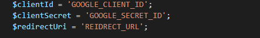

# Module d\'authification via google
## Environnement de développement

### Prérequis

        * Avoir prestashop 1.7 minimum 
        * avoir un acces oauth2.0 de goggle https://developers.google.com/identity/protocols/oauth2?hl=fr
    
## Usage
Installer le module

.

Remplacer  `GOOGLE_CLIENT_ID`, `GOOGLE_SECRET_ID` et `REIDRECT_URL` par les bonne informations fournie par google 

Le module est pret 